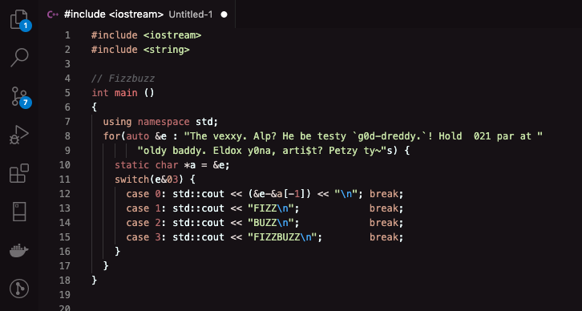

# Lychee Theme

* VSCode theme created by krleitch
* Color semantics inspired by monokai (https://github.com/microsoft/vscode/blob/main/extensions/theme-monokai/themes/monokai-color-theme.json)
* Editor colors inspired by celestial (https://github.com/apvarun/celestial-theme)

### Demo

### Resources

- https://code.visualstudio.com/api/references/theme-color